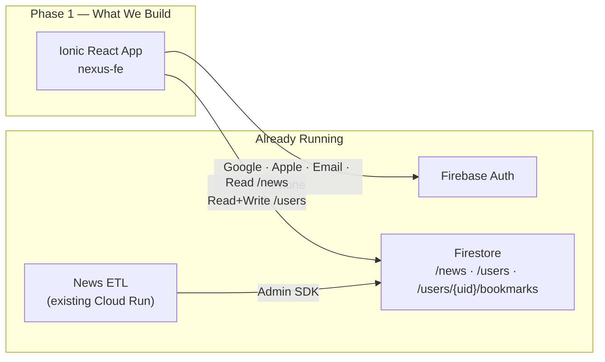

# Nexus — Final Implementation Plan v4 🔒 LOCKED

**All decisions confirmed. Zero open questions. Ready to build.**

---

## 🧠 Architecture — Phase 1



---

## ✅ Every Decision — Final Summary

### 🔑 Authentication
| Feature | Value |
|---------|-------|
| Providers | Google, Apple, Email Link (web redirect), Phone/OTP |
| Persistence | `LOCAL` — until explicit logout |
| Multi-device | Yes |
| First-time detection | Check `users/{uid}` doc exists in Firestore |

### 🎨 Design System
| Decision | Value |
|----------|-------|
| App name | **Nexus** |
| Default theme | **Dark** (Cred/Groww fintech style) |
| Theme toggle | In Profile tab |
| Accent | `#00D9A6` (electric teal) |
| Font | **Inter** (Google Fonts) |
| Card style | **Glassmorphism** (frosted glass) |
| App icon | 🎨 Generated by me |
| CSS | Ionic variables + vanilla CSS |

### 📱 Onboarding (First-Time Users)
| Screen | Content |
|--------|---------|
| 1 | Feature infographic (tracking, budgets) |
| 2 | Feature infographic (news, investments) |
| 3 | Profile form |

**Profile Form:**
| Field | Required | Auto-fill |
|-------|----------|-----------|
| Photo | Auto | ✅ Google avatar |
| First Name | ✅ | ✅ `displayName` |
| Last Name | ✅ | ✅ `displayName` |
| Gender | ✅ | ❌ |
| DOB | ✅ | ❌ |
| Currency (INR, USD...) | ✅ | ❌ |
| Monthly Income | ❌ Optional | ❌ |

- Skip allowed with gentle reminder
- Stored at `users/{uid}` → `onboardingComplete: true`

### 🧭 Navigation (5 Tabs)
| Position | Tab | Icon | Phase 1 |
|----------|-----|------|---------|
| 1 | 🏠 Home | `home` | ✅ News Reels |
| 2 | 🔖 Bookmarks | `bookmark` | ✅ Saved articles |
| 3 | 💰 Finance | `wallet` | Stub — "Coming Soon" |
| 4 | 📈 Invest | `trending-up` | Stub — "Coming Soon" |
| 5 | 👤 Profile | `person` | ✅ Settings + Theme + Logout |

---

## 🎴 News Card — Final Design

```
┌─────────────────────────────────────────────┐
│ ░░░░░░ GLASSMORPHISM BACKGROUND ░░░░░░░░░░  │
│                                             │
│  ┌──────────┐  ┌────────────┐               │
│  │ 🌍 Macro │  │ 🔴 Bearish │               │
│  └──────────┘  └────────────┘               │
│                                             │
│  Infosys, TCS to Wipro — IT stocks          │
│  fall up to 3% amid global tech             │
│  stocks selloff                             │
│                                             │
│  ─────────────────────────────────          │
│                                             │
│  • Indian IT stocks fell 2.5%...            │
│  • TCS, Infosys, Wipro declined...          │
│  • Decline is macro-driven...               │
│  • Sustained weakness could weigh...        │
│                                             │
│  ┌─────────────────────────────────┐        │
│  │ TCS · NIFTY IT · ₹              │        │
│  └─────────────────────────────────┘        │
│                                             │
│  ┌─────────────────────────────────────┐    │
│  │ ← INFY 0.8 · LTM 0.76 · HCLTECH   │    │
│  │   0.74 · TECHM 0.71 · PERSISTENT → │    │
│  └─────────────────────────────────────┘    │
│  (scrollable horizontal row — all tickers)  │
│                                             │
│ ◄══ ⚡Medium Impact · 2 sources confirm ══► │
│  (LED dot-matrix ticker — scrolling R→L)    │
│                                             │
│  livemint.com · ndtvprofit.com · 2h ago     │
│                                             │
│          🔖              ↗️                 │
│       Bookmark         Share                │
└─────────────────────────────────────────────┘
```

### Card Elements Breakdown

| Element | Description |
|---------|-------------|
| **Category badge** | Colored pill: 🌍 Macro, ⭐ Rating, 🤝 M&A, ⚖️ Regulatory, 👔 Management, 🚀 Product, 📰 General |
| **Sentiment badge** | 🟢 Bullish (teal), 🔴 Bearish (red), ⚪ Neutral (gray) |
| **Headline** | Large, bold, white text |
| **Key takeaways** | Bullet points (2-4 items) |
| **Stock ticker** | When `stock` field exists — ticker, sector, currency |
| **ReadThrough row** | Scrollable horizontal row of ALL correlated tickers with correlation scores |
| **LED ticker** | Scrolling marquee (R→L): materiality level + corroboration count |
| **Sources + time** | Source domains + relative time ("2h ago") |
| **Actions** | 🔖 Bookmark (double-tap also works) + ↗️ Share |

### LED Dot-Matrix Ticker
A subtle, continuously scrolling text bar near the bottom of the card:
- Styled like an LED message board (monospace font, subtle glow effect)
- Content: `"⚡ Medium Impact · Confirmed by 2 sources · NIFTY IT"`
- Scrolls right-to-left in a loop
- Not the full dot-matrix look, but inspired by it — clean, modern interpretation

### Category Colors
| Category | Color |
|----------|-------|
| `macro` | `#00D9A6` teal |
| `rating` | `#F5A623` gold |
| `m&a` | `#7C3AED` purple |
| `regulatory` | `#3B82F6` blue |
| `management` | `#EC4899` pink |
| `product` | `#10B981` emerald |
| `other` | `#6B7280` gray |

### Sentiment Colors
| Sentiment | Color |
|-----------|-------|
| `bullish` | `#00D9A6` |
| `bearish` | `#EF4444` |
| `neutral` | `#6B7280` |

---

## 📰 News Feed Behavior

| Behavior | Implementation |
|----------|---------------|
| Swipe up/down | Next/previous article (vertical Swiper) |
| Double-tap | Bookmark (with animation) |
| Pull-to-refresh | Reload latest from Firestore |
| Initial load | 3 articles |
| Pagination | Cursor-based (Firestore `startAfter`) |
| Offline | Firestore persistence enabled |
| Filter | Category chips at top: `All \| Macro \| Rating \| M&A \| ...` |
| Order | `publishedAt` descending (newest first) |

### Share Content
When user taps Share → native OS share sheet:
```
Infosys, TCS to Wipro — IT stocks fall up to 3% amid global tech stocks selloff

• Indian IT stocks fell up to 2.5% on Monday amid a broader global tech stocks selloff.
• TCS, Infosys, Wipro, and HCL Tech were among the notable decliners in the session.
• The decline appears macro/sentiment-driven rather than company-specific fundamental weakness.
• Sustained global tech weakness could weigh on IT sector valuations in the near term.

— via Nexus Finance
```

---

## 🔖 Bookmarks

### Storage Strategy (Hybrid)
**On bookmark action:**
- Write lightweight copy to `users/{uid}/bookmarks/{newsId}`:
  ```typescript
  {
    newsId: string;
    headline: string;
    category: string;
    sentimentLabel: string;
    sentiment: number;
    publishedAt: number;
    sources: string[];
    bookmarkedAt: number;  // timestamp
  }
  ```

**On viewing bookmarks page:**
- **Online**: Fetch fresh full article from `/news/{newsId}` using the stored `newsId`
- **Offline**: Display from the lightweight cached copy

### Bookmarks Page
- List view of bookmarked articles (card previews)
- Tap → opens full glassmorphism card view
- Swipe-to-unbookmark or unbookmark button
- Sorted by `bookmarkedAt` descending

---

## 📊 Firestore Schema

### `/news/{docId}` (read-only, populated by ETL)
```typescript
interface NewsArticle {
  id: string;
  headline: string;
  keyTakeaways: string[];
  category: 'macro' | 'other' | 'rating' | 'm&a' | 'regulatory' | 'management' | 'product';
  sentiment: number;
  sentimentLabel: 'bearish' | 'bullish' | 'neutral';
  materiality: 'low' | 'medium' | 'high';
  corroborationCount: number;
  publishedAt: number;
  sources: string[];
  stock?: {
    ticker: string;
    currency: string;
    sector: string;
    sentiment: number;
    sentimentLabel: string;
  };
  readThrough?: {
    sectorName: string;
    nodes: Array<{
      ticker: string;
      correlation: number;
      relationship: string;
    }>;
  };
}
```

### `/users/{uid}` (read/write by owner)
```typescript
interface UserProfile {
  uid: string;
  firstName: string;
  lastName: string;
  email: string;
  photoURL: string;
  gender: 'male' | 'female' | 'non-binary' | 'prefer-not-to-say';
  dob: string;              // ISO date
  currency: string;         // "INR", "USD", etc.
  monthlyIncome?: string;   // optional range
  onboardingComplete: boolean;
  theme: 'dark' | 'light';
  createdAt: number;
  updatedAt: number;
}
```

### `/users/{uid}/bookmarks/{newsId}`
```typescript
interface Bookmark {
  newsId: string;
  headline: string;
  category: string;
  sentimentLabel: string;
  sentiment: number;
  publishedAt: number;
  sources: string[];
  bookmarkedAt: number;
}
```

---

## 🏗️ Implementation Steps

### Step 1: Scaffolding
```
Nexus/
├── frontend/          ← Ionic 8 React + Vite + Capacitor
│   ├── src/
│   │   ├── assets/
│   │   ├── components/
│   │   ├── pages/
│   │   ├── context/
│   │   ├── hooks/
│   │   ├── services/
│   │   ├── utils/
│   │   ├── theme/
│   │   ├── types/
│   │   ├── App.tsx
│   │   └── main.tsx
│   ├── android/
│   ├── capacitor.config.ts
│   └── package.json
├── backend/           ← nexus-be repo (existing ETL)
├── firebase/
│   ├── firestore.rules
│   └── firebase.json
└── README.md
```

### Step 2: Design System
- CSS custom properties (dark theme default)
- Inter font from Google Fonts
- Glassmorphism classes (`backdrop-filter`, `bg-opacity`, border glow)
- LED ticker animation (CSS `@keyframes marquee`)
- Generate app icon/logo for "Nexus"

### Step 3: Authentication
- `services/firebase.ts` — Firebase init with alchemist config
- `context/AuthContext.tsx` — auth state, providers, first-time detection
- `pages/LoginPage.tsx` — branded login with 4 provider buttons
- Deep link handling for email auth

### Step 4: Onboarding
- `pages/OnboardingPage.tsx` — 3-screen Swiper
- 2 generated infographic illustrations
- `components/ProfileForm.tsx` — form with auto-fill
- Write to `users/{uid}` on completion

### Step 5: News Home
- `pages/HomePage.tsx` — vertical Swiper reel
- `components/NewsCard.tsx` — glassmorphism card with all elements
- `components/CategoryFilter.tsx` — horizontal filter chips
- `components/SentimentBadge.tsx`
- `components/LedTicker.tsx` — scrolling marquee
- `components/ReadThroughRow.tsx` — horizontal scrollable tickers
- `hooks/useNews.ts` — Firestore query + pagination
- `services/news.ts` — Firestore queries

### Step 6: Bookmarks
- `pages/BookmarksPage.tsx` — list view
- `hooks/useBookmarks.ts` — CRUD + hybrid fetch
- `services/bookmarks.ts` — Firestore operations

### Step 7: Profile
- `pages/ProfilePage.tsx` — avatar, name, theme toggle, logout
- `context/ThemeContext.tsx` — dark/light state + persistence

### Step 8: Navigation
- `App.tsx` — 5-tab `IonTabBar` + routing
- Protected routes (auth guard)
- Tab icons: `home`, `bookmark`, `wallet`, `trending-up`, `person`

---

## Verification
```bash
npm run lint          # TypeScript strict
npm run build         # Production build validates
ionic serve           # Web preview
npx cap sync android  # Android project sync
```

Manual testing:
- All 4 auth providers
- New user → onboarding → home
- Returning user → home
- News reel: swipe, double-tap bookmark, share
- Category filter chips
- LED ticker animation
- ReadThrough scrollable row
- Bookmarks tab: view, unbookmark
- Theme toggle (dark ↔ light)
- Pull-to-refresh
- Offline mode

---

> [!IMPORTANT]
> ## ⏸️ BUILD PROMPT 1 of 2
> 
> The plan is **100% locked**. All decisions are final.
> 
> **This is your first reminder**: Switch to **Gemini 3.1 Pro High** when you're ready to build.
> 
> Reply with anything and I'll send **prompt 2 of 2**, then begin building.
